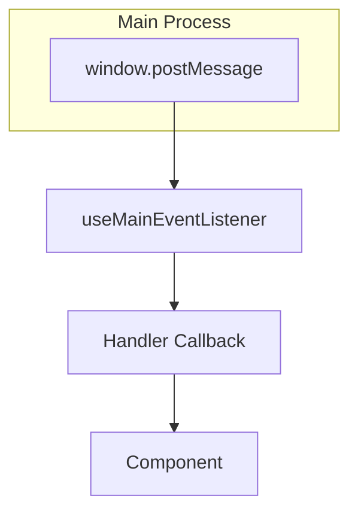

# RFC: useMainEventListener Hook

## Motivation

The current `EventHandlerProvider` centralizes main event handling at the provider level, limiting reusability and flexibility. Refactoring this logic into a `useMainEventListener` hook enables component-level event handling, improves modularity, and simplifies integration.

## API Design

```typescript
type EventHandlers = {
  set_config?: (data: ChatWidgetConfig) => void;
  toggleExpand?: (data: { success?: boolean; expanded?: boolean }) => void;
  chatProviderListSessions?: (data: DataOrError<ChatProviderSession[]>) => void;
  chatProviderListSessionMessages?: (
    data: DataOrError<ChatProviderListSessionMessagesMessage[]> & {
      sessionId: string;
    }
  ) => void;
  // Extendable for additional event types
};

function useMainEventListener(handlers: EventHandlers): void;
```

- **Inputs:** Map of event type handlers.
- **Outputs:** None (side-effect only).
- **Usage:** Call in any component to subscribe to main events.

## Implementation Plan

- Use `useEffect` to subscribe to `window` message events.
- On receiving a message:
  - Check origin and event type.
  - Call the appropriate handler from the map.
- Clean up event listener on unmount.
- Optionally send an "init" event on mount.
- No context required; all logic is local to the hook.

## Integration Steps

- Remove `EventHandlerProvider` from the component tree.
- In each component needing event handling, call `useMainEventListener` with relevant handlers.
- Ensure shared state updates (e.g., config, query cache) are handled via context/hooks as before.

## Event Flow and Hook Usage



## Example Usage

```typescript
useMainEventListener({
  set_config: (data) => {
    /* update config */
  },
  toggleExpand: (data) => {
    /* update UI */
  },
  chatProviderListSessions: (data) => {
    /* update sessions */
  },
  chatProviderListSessionMessages: (data) => {
    /* update messages */
  },
});
```

## Review

Please review this RFC and suggest any changes before implementation.
